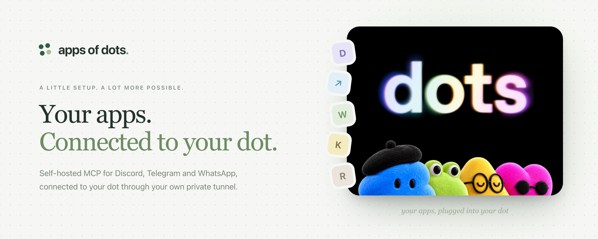
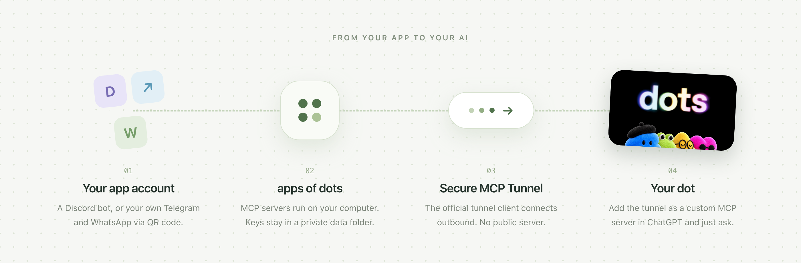
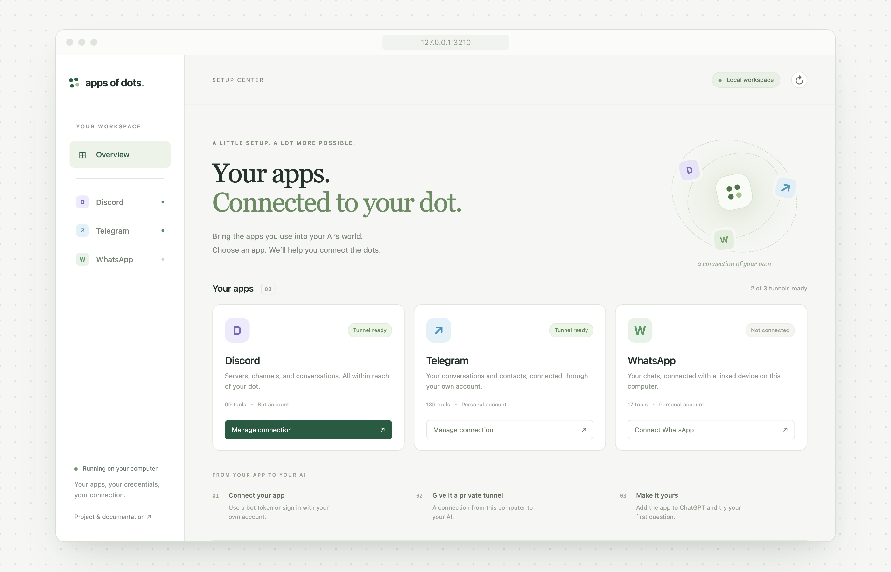
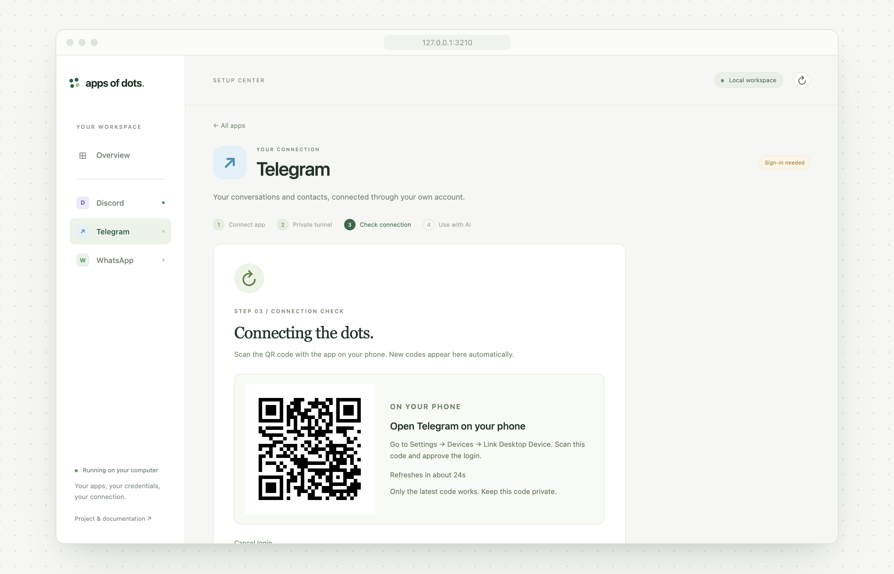
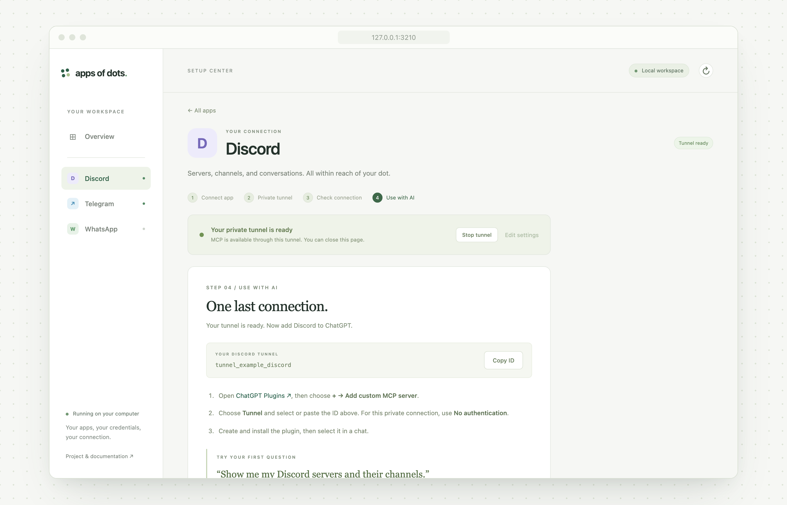

<div align="center">
  
  <h1>apps of dots</h1>
  <p>Bring your apps to your OpenAI dot.</p>
  <p>
    <b>Self-hosted MCP for Discord, Telegram and WhatsApp, connected through your own Secure MCP
    Tunnel. No public server needed.</b>
  </p>
  <p>
    <a href="https://github.com/rokrokss/apps-of-dots/actions/workflows/ci.yml"></a>
    <a href="LICENSE"></a>
    
    
  </p>
  <p>
    <a href="#installation">Install</a> · <a href="#local-setup-center">Setup center</a> ·
    <a href="discord/README.md">Discord</a> · <a href="telegram/README.md">Telegram</a> ·
    <a href="whatsapp/README.md">WhatsApp</a> · <a href="core/docs/architecture.md">Architecture</a> ·
    <a href="CONTRIBUTING.md">Contributing</a>
  </p>
  <p>English is the primary language of this project. Translation: <a href="README.ko.md">한국어</a></p>
</div>

## Intro

[dots](https://openai.com/index/introducing-dots/) are OpenAI's always-on agents in ChatGPT, and
they reach your apps through plugins. apps of dots adds the apps you run yourself: each integration
is a local MCP server on your computer, and Secure MCP Tunnel connects supported OpenAI clients to
it without a public server. One command line and one local setup page manage them all.

| Integration          | Location                                                                             | What it provides                                                        |
| -------------------- | ------------------------------------------------------------------------------------ | ----------------------------------------------------------------------- |
| **Discord**          | [Built in](discord/)                                                                 | All **99 upstream MCP tools**, through Secure MCP Tunnel or local stdio |
| **Telegram**         | [Built in](telegram/)                                                                | All **139 upstream tools**, personal account via Telethon               |
| **WhatsApp**         | [Built in](whatsapp/)                                                                | All **17 upstream tools**, personal linked device via whatsmeow         |
| **KakaoTalk Bridge** | [External project](https://github.com/rokrokss/kakaotalk-bridge)                     | Follow its own installation and connection guide                        |
| **Recly Events**     | [External project](https://github.com/rokrokss/recly/blob/main/docs/recly-events.md) | Follow its own events setup guide                                       |

Discord includes messaging, channels, members, roles, moderation, forums, webhooks, scheduled-event
management, invitations, and DMs. It does **not** implement MCP Events. Discord scheduled-event
tools remain available.

## How it works

<p align="center">
  
</p>

Your credentials and account sessions stay in a private data directory on your computer. The
official tunnel-client opens an outbound connection to OpenAI, and you add that tunnel to ChatGPT as
a custom MCP server. See the [architecture](core/docs/architecture.md) for process and credential
details.

## Installation

```sh
git clone https://github.com/rokrokss/apps-of-dots.git
cd apps-of-dots
pnpm install --frozen-lockfile
pnpm build
```

| Requirement                                                                    | Used by                                     |
| ------------------------------------------------------------------------------ | ------------------------------------------- |
| Node.js 24+ and pnpm 10                                                        | Everything                                  |
| [tunnel-client](https://github.com/openai/tunnel-client#install-with-homebrew) | Every tunnel                                |
| [uv](https://docs.astral.sh/uv/)                                               | Telegram and WhatsApp (fetches Python 3.12) |
| Go 1.26+ and a C compiler                                                      | WhatsApp bridge                             |

<details>
<summary><strong>macOS: install every requirement with Homebrew</strong></summary>

```sh
xcode-select --install
brew install node pnpm uv go openai/tools/tunnel-client
```

`xcode-select` provides the C compiler.

</details>

<details>
<summary><strong>Standalone <code>apps-of-dots</code> command</strong></summary>

Run `pnpm link --global` after building. Its global bin directory must be on your PATH; keep this
checkout in place. There is no published npm release yet.

</details>

<details>
<summary><strong>Laptops and multiple machines</strong></summary>

- Set up each machine separately and sign in to Telegram and WhatsApp there with a QR code. Do not
  copy the private data directory (`~/Library/Application Support/apps-of-dots` on macOS): it holds
  absolute paths and locally built binaries, and a Telegram session used from two machines at once
  fails with a duplicate-session error.
- Run one active client per tunnel ID. Give each machine its own tunnel IDs, or stop the old one
  first.
- Stopping a tunnel does not revoke an account session. Remove machines you no longer use from the
  Telegram and WhatsApp device lists.
- A sleeping laptop disconnects its tunnels. `caffeinate -i` prevents idle sleep while it runs; it
  does not prevent sleep when the lid is closed.

</details>

## Local setup center

After [installation](#installation), run:

```sh
pnpm apps-of-dots ui
```

<p align="center">
  
</p>

The local setup center guides Discord, Telegram, and WhatsApp account and tunnel configuration, live
status, start/stop controls, and adding the app to ChatGPT. Telegram and WhatsApp show QR codes here
to scan with your phone, refresh expired codes, and start the tunnel after account approval.
Telegram may request its two-step password; it is used only for that login and is not saved. You can
cancel login or return to it after refreshing the page.

<p align="center">
  
  
</p>

Existing CLI settings are reused; leave credential fields blank to keep saved keys. Stop a running
tunnel before editing its settings or signing in again. Each app needs its own tunnel ID. The CLI
remains available for terminal setup and automation. KakaoTalk and Recly link to their own guides.
Tunnel readiness is separate from a successful tool call: try the suggested question in ChatGPT to
verify account access. The setup center does not record AI tool-call success.

The page is served only on `127.0.0.1:3210`. Keep the printed setup link private: its fragment
grants access to the management API. Credentials are saved in the same private files as the CLI and
are never returned by the web API. The setup center must stay running for setup jobs; refreshing or
closing the browser does not cancel them. Stopping this UI server cancels pending account logins and
leaves started MCP tunnels running. After a computer reboot, start the tunnels again.

Use `ui --no-open` to print the link without opening a browser, `ui --port 0` to pick a free port,
or `--home /path/to/data ui` to select an existing data directory. There is no remote/public UI
mode.

## Start with Discord

You need a Discord bot token and an OpenAI tunnel ID with its runtime key.

```sh
pnpm apps-of-dots discord setup
pnpm apps-of-dots discord start
pnpm apps-of-dots discord status
```

Setup collects keys with hidden input. Enable **Message Content** and **Server Members** intents in
the Discord Developer Portal and invite the bot to your server. Every tool is exposed; Discord
permissions and role hierarchy determine which actions the bot can perform.

Once status reports `ready: true`, open ChatGPT Plugins → **Add custom MCP server** → **Tunnel**,
select your tunnel, and choose **No authentication**. The tunnel's access controls protect this
private connection. Associate the tunnel with your ChatGPT workspace so it appears in the picker.

Try: “List my Discord servers and the channels in this server.”

## Telegram and WhatsApp

All three MCP implementations live in this repository: `discord/server`, `telegram/server`, and
`whatsapp/server` + `whatsapp/bridge`. No external MCP package or checkout is needed at runtime.
Telegram/WhatsApp setup installs locked libraries using `uv` and builds the local WhatsApp bridge
(see [requirements](#installation)). Use a separate tunnel ID for each app.

```sh
pnpm apps-of-dots telegram setup
pnpm apps-of-dots telegram login
pnpm apps-of-dots telegram start
pnpm apps-of-dots telegram status

pnpm apps-of-dots whatsapp setup
pnpm apps-of-dots whatsapp login
pnpm apps-of-dots whatsapp start
pnpm apps-of-dots whatsapp status
```

Telegram setup needs an API ID/hash from `my.telegram.org`. The setup center displays the QR code
locally; the CLI `login` command displays it in the terminal. Telegram may also request its two-step
password, which is never saved. Credentials and persistent sessions stay in the private data
directory. The tools act as your personal account. Follow the [Telegram](telegram/README.md) and
[WhatsApp](whatsapp/README.md) guides for setup and file access.

Both provide `status`, `stop`, `restart`, `logs`, `doctor`, `tools`, and local `mcp` commands.
WhatsApp supervises its Go bridge and Python MCP together. Optional transcription services/models
are not provisioned, and neither integration adds OpenAI MCP Events delivery.

## Everyday commands

All apps use `setup → start → status`; Telegram and WhatsApp add QR `login` after setup. Common
command names, help order, setup summaries and startup hints are shared. Replace `discord` below
with `telegram` or `whatsapp` for the same operations.

```sh
pnpm apps-of-dots list
pnpm apps-of-dots discord tools
pnpm apps-of-dots discord doctor
pnpm apps-of-dots discord doctor --live
pnpm apps-of-dots discord logs --follow
pnpm apps-of-dots discord restart
pnpm apps-of-dots discord stop
```

`doctor` checks local setup. Use `doctor --live` for account checks with these prerequisites;
diagnostics never start or stop a tunnel for you:

| App      | Before `doctor --live`                                               |
| -------- | -------------------------------------------------------------------- |
| Discord  | Tunnel may be running or stopped; the bot token is checked directly. |
| Telegram | Run `telegram stop`; run `telegram start` again afterward.           |
| WhatsApp | Run `whatsapp start`; live checks use the running bridge.            |

`start` uses official tunnel-client background process management. Closing the terminal does not
stop it. **After a reboot, run `start` again**; this version does not install a login or boot
service. The host must remain online.

Setup, status, tools, and diagnostics offer `--json`. Use `--home <path>` or `APPS_OF_DOTS_HOME` for
an isolated installation. KakaoTalk and Recly remain external projects; this CLI does not change
their installations.

## Project status

This is the first implementation. macOS has local CLI and MCP contract coverage; CI is configured
for macOS and Linux on Node 24. Real account logins and app/tunnel/dot round trips require your
credentials and have not been verified in this checkout. Windows and automatic startup are follow-up
work.

```sh
pnpm test       # Build, real stdio tool parity, isolated lifecycle tests
pnpm test:servers # Build local Python/Go servers and verify all tool schemas (no login)
pnpm check      # Formatting and TypeScript
pnpm audit --prod
```

## Credits and license

Built on [PaSympa/discord-mcp](https://github.com/PaSympa/discord-mcp), inspired by
[PR #151](https://github.com/PaSympa/discord-mcp/pull/151) and the
[KakaoTalk Bridge CLI](https://github.com/rokrokss/kakaotalk-bridge). See
[upstream provenance](discord/UPSTREAM.md) and [license notices](THIRD_PARTY_NOTICES.md).

The local Telegram implementation derives from
[chigwell/telegram-mcp](https://github.com/chigwell/telegram-mcp); WhatsApp derives from
[verygoodplugins/whatsapp-mcp](https://github.com/verygoodplugins/whatsapp-mcp). See
[Telegram](telegram/UPSTREAM.md) and [WhatsApp](whatsapp/UPSTREAM.md) source provenance.

README images are rendered from [`brand/`](brand/) with `brand/render.sh`. The dots artwork in them
is OpenAI's, from the [dots announcement](https://openai.com/index/introducing-dots/), and is not
covered by this repository's license. The setup center screenshots show example connection states.

MIT licensed, with imported Telegram source under Apache-2.0. An independent community project, not
an official product of OpenAI or the connected apps.
