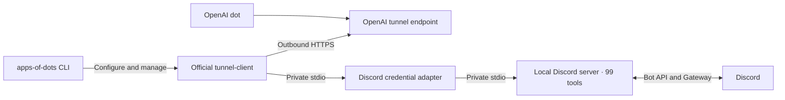

# Architecture

One local Discord server process runs per managed tunnel. The stdio adapter loads private
configuration and forwards process streams and shutdown signals. It does not interpret or rewrite
tool calls. There is no Discord HTTP listener or MCP Events subsystem.

| Directory               | Responsibility                                                                  |
| ----------------------- | ------------------------------------------------------------------------------- |
| `src/`                  | CLI name, help, catalog, and command registration                               |
| `discord/`              | Local TypeScript server, bot configuration, commands, contract tests            |
| `telegram/`             | Local Python server, personal-account QR login, Telethon environment            |
| `whatsapp/`             | Local Go bridge and Python server, pairing and supervision                      |
| `packages/managed-mcp/` | Local code/dependency preparation, private config, lifecycle CLI, child cleanup |
| `packages/runtime/`     | Private storage, quoting, official tunnel management                            |
| `kakaotalk/`, `recly/`  | Externally maintained integration references                                    |

The common runtime has no Discord dependency. It uses an app ID, data directory, executable command,
and tunnel/key references. The official client owns native supervision, process identity, profiles,
and logs. Our CLI checks status after launch; a PID alone does not mean ready.

Credential values stay out of argv and normal output. The tunnel key is a file reference; the
Discord token is injected into the local child environment. This prevents accidental disclosure in
CLI history, not access by the same OS user or administrators. Local credential files are not
encrypted.

The catalog is static. External entries do not create runtimes, impose a language, or install
third-party software. A new managed integration should bring an actual implementation and document
its capabilities.

## Managed personal messaging accounts

Telegram and WhatsApp each get their own tunnel alias, private runtime, credential generation and
persistent account directory. `setup` installs frozen Python dependencies and builds local Go code;
`login` performs interactive pairing outside the MCP channel. MCP source stays in this repository. A
source fingerprint detects stale installations. Runtime starts never install dependencies or prompt
for credentials.

Telegram runs the local Python entrypoint directly. WhatsApp runs a Go bridge from its persistent
data directory, waits for authenticated loopback health, then starts the Python MCP. A supervisor
forwards MCP bytes unchanged and cleans up children on failure, signals and stdin EOF. Only the
Python MCP owns stdout. Bridge output joins stderr and native tunnel logs.

The personal-account integrations use `packages/managed-mcp` for installation, configuration, CLI
lifecycle and process utilities. Their account-specific code remains in the top-level app package.
The common `packages/runtime` still owns native tunnel management and private storage primitives.

Offline `tools` inspection imports the local FastMCP definitions with a temporary empty session and
skips account startup; it does not make live app calls. Normal serving always uses the real
entrypoint. `test:servers` compares all actual MCP schemas to the frozen original definitions.
