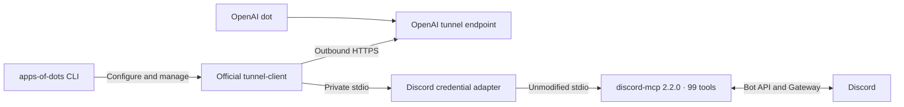

# Architecture

One upstream Discord process runs per managed tunnel. The stdio adapter loads private configuration
and forwards process streams and shutdown signals. It does not interpret or rewrite tool calls.
There is no Discord HTTP listener or MCP Events subsystem.

| Directory              | Responsibility                                                |
| ---------------------- | ------------------------------------------------------------- |
| `src/`                 | CLI name, help, catalog, and command registration             |
| `discord/`             | Bot configuration, upstream process, commands, contract tests |
| `packages/runtime/`    | Private storage, quoting, official tunnel management          |
| `kakaotalk/`, `recly/` | Externally maintained integration references                  |

The common runtime has no Discord dependency. It uses an app ID, data directory, executable command,
and tunnel/key references. The official client owns native supervision, process identity, profiles,
and logs. Our CLI checks status after launch; a PID alone does not mean ready.

Credential values stay out of argv and normal output. The tunnel key is a file reference; the
Discord token is injected into the upstream child environment. This prevents accidental disclosure
in CLI history, not access by the same OS user or administrators. Local credential files are not
encrypted.

The catalog is static. External entries do not create runtimes, impose a language, or install
third-party software. A new managed integration should bring an actual implementation and document
its capabilities.
